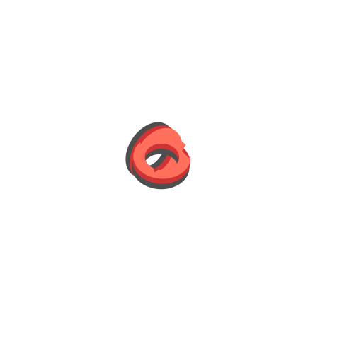

# Sculpt

A direct manipulation drawing tool implemented in javascript inspired by
the [this video](https://www.youtube.com/watch?v=ef2jpjTEB5U) from Bret Victor.

Uses ReactJS for creating components and SVG for rendering.

## Alpha release

### Features
* Implementation of Draw, Move, Scale and Rotate for components.
* Handlers defined only for rectangle.
* Ability to select / replay steps
* Ability to loop steps without data binding

### Roadmap
* Add support for one more primitive component
* Add support for data expressions and binding

### Running
* npm install
* npm run start
* Navigate to `http://localhost:3010/editor`
